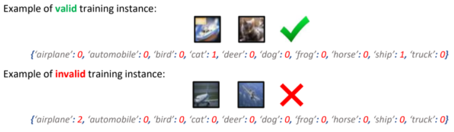

# Multi-Label CIFAR10 Training/Evaluation Framework
This is a __simple framework for building, training and evaluating DNNs__ for __multi-label classification problems with 
ambiguity__, meaning it is not said what image is what class. For example: 

Project was developed with Keras (TF v2 Backend).

## Installation
1. Clone the project: `git clone https://github.com/alexgoft/cool_cifar10.git` 
2. CD into project directory.
3. Create virtual environment inside project directory: `virtualenv -p python3.6 venv`
4. Activate environment: `source venv/bin/activate`
5. Install packages: `pip install -r requirements.txt`

## Quick Start
1. Configure model architecture, training hyper parameters and other useful parameters inside the config file `config.yaml`.
2. To run training/evaluation, simply:

    `python train.py`

## Files
- `config.py`: Configurations file. 
- `train.py`: Training script on training data.
- `eval.py`: Evaluation script on validation data.
- `data.py`: Data generation script (training was sampled as described in the exercise document).

## Remarks
- ~~For some reason, it seems that the eval script is buggy.~~
- "Hard coded" augmentation inside generator. Didn't have the chance to add code that toggle them via config file. (sorry..)
- Reached in peak performance ~84% accuracy on validation data
- Current architecture is "light weight VGG" with sigmoid as final activation and binary cross entropy as a loss function.
